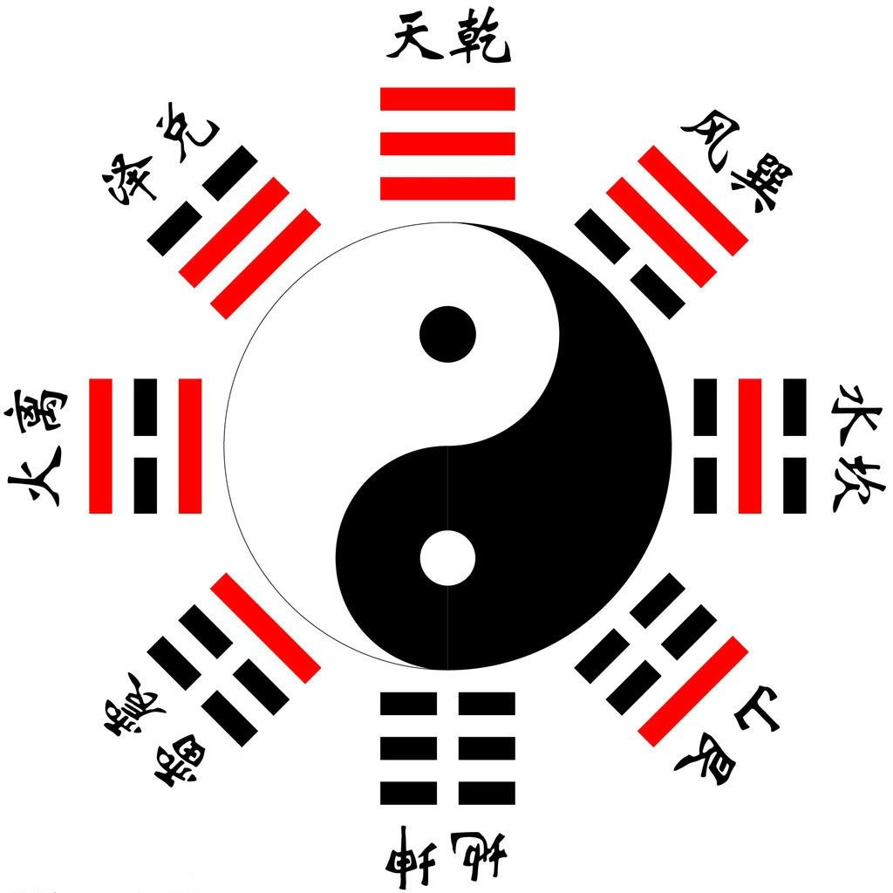

# YI - 易 - BOOK OF CHANGE

YI (I Ching) (《易经》)，fouth tone in Chinese, meaning is "Changes". The book talks about how human to observe, understand, feel and participate the changes, both internally and externally.

It's the TOP book in Chinese history, most of the knowledge were inherit and derived from it.

《周易-系辞传》云：”易有太极，是生两仪，两仪生四象，四象生八卦。“

In English, "YI has Tai Chi, which produces Two Positions(Yin - Negative & Yang - Positive), Two Positions produce Four Phases, Four Phases produce Gossip (8-Gua)"

## Model "YI" in Archi

在此使用 [Archi](https://www.archimatetool.com/) 工具进行模型化。如下概览：

This repository is trying to use ArchiMate Tool (Archi) to model the structure of YI, and find out the inner relationships that ancient Chinese people to describe the world & universe!

When you look as Tai Chi (NULL), Yin (0), Yang (1), then 4 phases (00, 01, 10, 11), 8 guas (000 to 111), and further 64 gua (000-000 to 111-111), and then finally adding six element (stick) consideration, you get 64 x 6 = 384 different changes patterns. The 0 - 1 pattern are always along with the change, so this model is aiming to use binary to label and position the elements and see how computerized methods are interactive with this ancient theory!

Please clone to local then you can view the website for elements/views in Browser via [index.html](./archi_model_Yi/index.html).

You can browse directly from the github page here: https://yasenstar.github.io/yi/archi_model_Yi/index.html

Keep adding more detail.

## Model "YI" in Ontology using Protege

Check the ontology file here: [yi.owl](./yi-ontology/yi.owl)

Using WebVOWL, you can see the graph [here](https://service.tib.eu/webvowl/#iri=https://yasenstar.github.io/yi/yi-ontology/yi-rdf.owl).