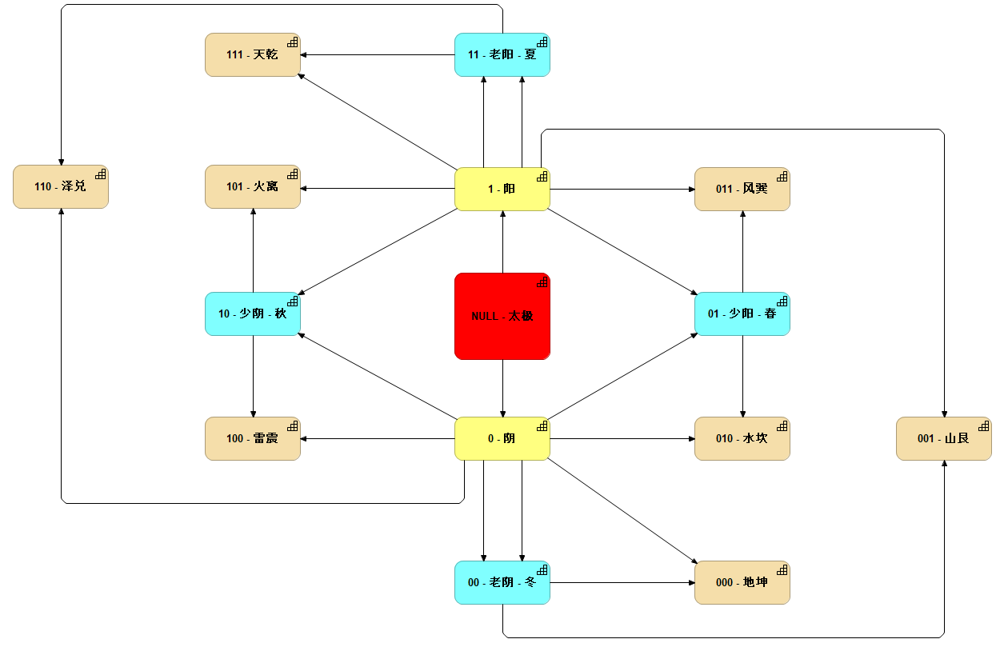

# YI - 易

《周易-系辞传》云：”易有太极，是生两仪，两仪生四象，四象生八卦。“

In English, "YI has Tai Chi, which produces Two Positions(Yin - Negative & Yang - Positive), Two Positions produce Four Phases, Four Phases produce Gossip (8-Gua)"

在此使用 [Archi](https://www.archimatetool.com/) 工具进行模型化。如下概览：

This repository is trying to use ArchiMate Tool (Archi) to model the structure of YI, and find out the inner relationships that ancient Chinese people to describe the world & universe!

Please clone to local then you can view the website for elements/views in Browser.

Keep adding more detail.